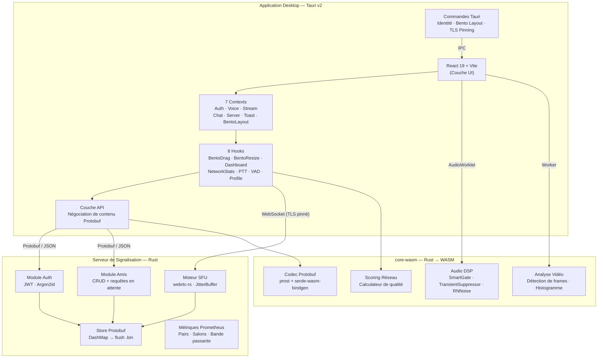
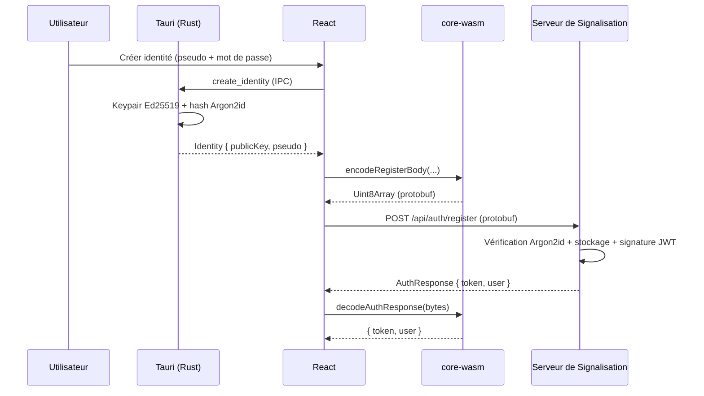
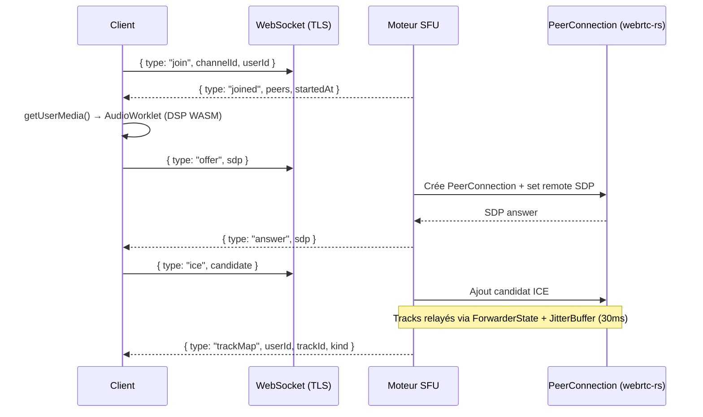

# Void (FR)

Client vocal et vidéo multiplateforme haute performance : un système de communication en temps réel entièrement distribué construit avec **Rust**, **WebAssembly**, **Tauri v2** et **React 19**. Void est une infrastructure pair-à-pair complète pour la voix, la vidéo et la messagerie — conçue pour vous donner le contrôle total de vos communications.

## Architecture



## Stack Technique

| Couche | Technologies |
|---|---|
| **Shell Desktop** | Tauri v2, Rust, Certificate Pinning TLS |
| **Frontend** | React 19, TypeScript, TailwindCSS v4, Vite 7 |
| **Audio Temps Réel** | WebRTC, AudioWorklet, RNNoise, DSP WASM |
| **Noyau WASM** | Rust, wasm-bindgen, prost (protobuf) |
| **Serveur de Signalisation** | Axum, Tokio, webrtc-rs, DashMap |
| **Auth** | Ed25519 (keypair local), Argon2id, JWT HS256 |
| **Observabilité** | Prometheus, Grafana, Alertmanager |
| **Sérialisation** | Protobuf (prost) avec fallback JSON |

## Structure du Monorepo

```
void/
├── apps/desktop/              # App desktop Tauri + React + Vite
│   ├── src/                   # Frontend React (contexts, hooks, composants)
│   ├── src-tauri/             # Backend Rust (identité, Bento layout, TLS)
│   └── public/worker/         # Worklets audio compilés
├── packages/
│   ├── core-wasm/             # Rust → WASM (DSP, codec, vidéo, réseau)
│   └── signaling-server/      # Signalisation Rust + SFU + auth + amis
├── docker/                    # Configs Prometheus, Grafana, Alertmanager
├── Cargo.toml                 # Workspace Rust
└── pnpm-workspace.yaml        # Workspace pnpm
```

## Flux Principaux

### Authentification



### Voix (SFU WebRTC)



## Démarrage Rapide

```sh
pnpm install
cd apps/desktop
pnpm dev
```

### Compiler le Noyau WASM

```sh
cd packages/core-wasm
wasm-pack build --target web --out-dir ../../apps/desktop/src/pkg
```

### Compiler le Worklet Audio

```sh
cd apps/desktop
pnpm build:worklet
```

### Build Desktop Natif

```sh
pnpm tauri build
```

## Observabilité (Docker)

```sh
docker compose up -d
```

Lance Prometheus (`:9090`), Grafana (`:3000`), Alertmanager (`:9093`), Node Exporter (`:9100`).

## Observabilité & Déploiement

La production s'exécute sur un **cluster k3s** (Oracle Ampere A1 / ARM64). Chaque push vers `main` déclenche un pipeline GitHub Actions qui compile de manière croisée le serveur de signalisation, construit et pousse l'image de conteneur vers GHCR, puis applique automatiquement les manifestes Kubernetes au cluster — aucune étape de déploiement manuel requise.

Consultez [.github/workflows/deploy-signaling.yml](./.github/workflows/deploy-signaling.yml) et [deployment-k3s.yaml](./deployment-k3s.yaml) pour le pipeline complet. La pile comprend Prometheus, Grafana et Alertmanager aux côtés du serveur de signalisation, déployés dans l'espace de noms `void`, avec TLS géré par Traefik + cert-manager.

## Contribuer

Void est ouvert aux contributions. Lisez [CONTRIBUTING.md](./CONTRIBUTING.md) pour le workflow, les normes de code et comment signer le CLA avant d'ouvrir une PR.

## ⚖️ Licence & Utilisation Commerciale

**Void** est un projet de qualité production distribué sous la **Business Source License 1.1 (BSL-1.1)**.

* **Utilisation Personnelle & Non-Commerciale :** Vous êtes entièrement autorisé à cloner le référentiel, lire/modifier le code source, et auto-héberger votre propre infrastructure Void pour communiquer et collaborer avec votre équipe ou vos amis gratuitement. 🎮
* **Contributions & Développement :** L'engagement de la communauté est bienvenu. Vous pouvez ouvrir des issues, explorer l'architecture, ou soumettre des Pull Requests (selon les termes de notre `CONTRIBUTING.md`).
* **Usage Commercial :** Vous ne pouvez **pas** utiliser l'Œuvre Licenciée pour tout usage principalement destiné à ou dirigé vers un avantage commercial ou une compensation monétaire (par exemple, vendre des emplacements d'hébergement, construire une plateforme de communication commerciale, ou intégration commerciale) sans arrangements de licences alternatives de la part du concédant.

### La Transition Open Source (GPL)

Selon les termes de la BSL, cette restriction commerciale a une date d'expiration stricte. Le **7 avril 2031**, cette version du logiciel se convertira automatiquement et définitivement à la licence open source **GNU General Public License v3.0 ou ultérieure (GPL-3.0-or-later)**.

*Pour les termes complets et légalement contraignants (texte anglais et traduction officielle française), veuillez consulter le fichier [LICENSE](./LICENSE).*
