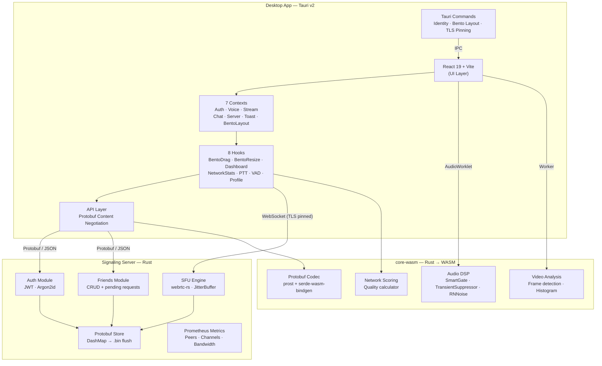
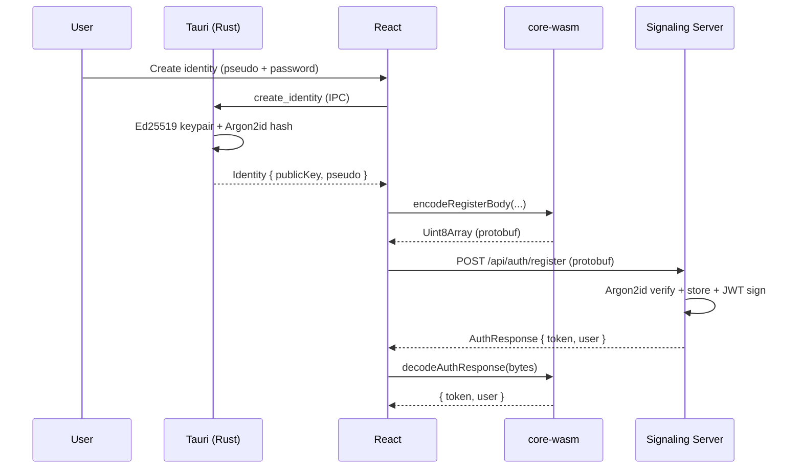
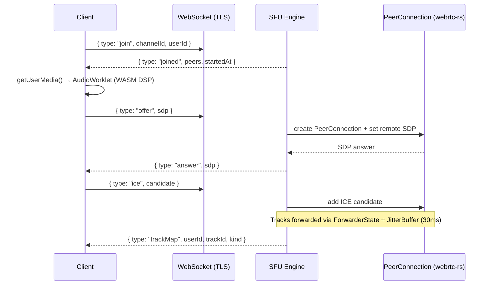

# Void

A cross-platform, high-performance real-time communication system built with **Rust**, **WebAssembly**, **Tauri v2** and **React 19**. Void is a fully distributed, peer-to-peer infrastructure for voice, video, and messaging—designed to put you in complete control of your communications.

> 🇫🇷 **Lisez en français ?** Consultez [README.fr.md](./README.fr.md) pour la documentation en français.

---

## Architecture



## Tech Stack

| Layer | Technologies |
|---|---|
| **Desktop Shell** | Tauri v2, Rust, TLS Certificate Pinning |
| **Frontend** | React 19, TypeScript, TailwindCSS v4, Vite 7 |
| **Real-time Audio** | WebRTC, AudioWorklet, RNNoise, WASM DSP |
| **WASM Core** | Rust, wasm-bindgen, prost (protobuf) |
| **Signaling Server** | Axum, Tokio, webrtc-rs, DashMap |
| **Auth** | Ed25519 (local keypair), Argon2id, JWT HS256 |
| **Observability** | Prometheus, Grafana, Alertmanager |
| **Serialization** | Protobuf (prost) with JSON fallback |

## Monorepo Structure

```
void/
├── apps/desktop/              # Tauri + React + Vite desktop app
│   ├── src/                   # React frontend (contexts, hooks, components)
│   ├── src-tauri/             # Rust backend (identity, Bento layout, TLS)
│   └── public/worker/         # Compiled audio worklets
├── packages/
│   ├── core-wasm/             # Rust → WASM (DSP, codec, video, network)
│   ├── void-sfu/               # SFU engine (webrtc-rs): ICE/SDP, RTP/SCTP forwarding
│   └── signaling-server/      # Rust REST + WS signaling, embeds void-sfu
├── docs/                      # Documentation hub — see docs/README.md
├── docker/                    # Prometheus, Grafana, Alertmanager configs
├── Cargo.toml                 # Rust workspace
└── pnpm-workspace.yaml        # pnpm workspace
```

## Documentation

Full docs — deployment/infra, security model, generated Rust API reference — live in [`docs/`](./docs/README.md).

## Key Flows

### Authentication



### Voice (SFU WebRTC)



## Quick Start

```sh
pnpm install
cd apps/desktop
pnpm dev
```

### Build WASM Core

```sh
cd packages/core-wasm
wasm-pack build --target web --out-dir ../../apps/desktop/src/pkg
```

### Build Audio Worklet

```sh
cd apps/desktop
pnpm build:worklet
```

### Native Desktop Build

```sh
pnpm tauri build
```

## Observability (local dev)

```sh
docker compose up -d
```

Starts Prometheus (`:9090`), Grafana (`:3000`), Alertmanager (`:9093`), Node Exporter (`:9100`) locally — useful for developing against the monitoring stack without touching the real cluster.

## Deployment

Production and staging both run on a **k3s cluster** (Oracle Ampere A1 / ARM64), one namespace each, deployed automatically by CI (push to `main` → staging, push a `v*` tag → production). See [docs/DEPLOYMENT.md](./docs/DEPLOYMENT.md) for the full setup: ports, TLS, secrets, and CI/CD flow.

## Contributing

Void is open to contributions. Read [CONTRIBUTING.md](./CONTRIBUTING.md) for the workflow, code standards, and how to sign the CLA before opening a PR.

## ⚖️ License & Commercial Use

**Void** is a production-grade project distributed under the **Business Source License 1.1 (BSL-1.1)**.

* **Personal & Non-Commercial Use:** You are fully allowed to clone the repository, read/modify the source code, and self-host your own Void infrastructure to communicate and collaborate with your team or friends for free. 🎮
* **Contributions & Development:** Community engagement is welcome. You can open issues, explore the architecture, or submit Pull Requests (subject to our `CONTRIBUTING.md` terms).
* **Commercial Purpose:** You may **not** use the Licensed Work for any use that is primarily intended for or directed toward commercial advantage or monetary compensation (e.g., selling hosting slots, building a commercial communication platform, or commercial embedding) without alternative licensing arrangements from the licensor.

### The Open Source Transition (GPL)
Per BSL terms, this commercial restriction has a strict expiration date. On **April 7, 2031**, this version of the software will automatically and permanently convert to the Open Source **GNU General Public License v3.0 or later (GPL-3.0-or-later)**.

*For the full legally binding terms (English text and official French translation), please refer to the [LICENSE](./LICENSE) file.*

